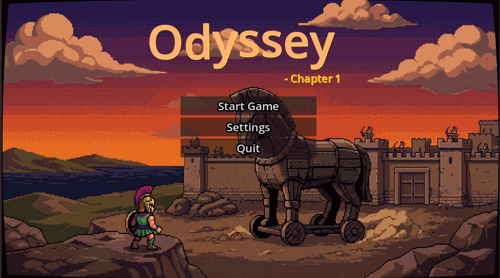

# Odyssey

A Greek mythology-themed 2D minigame collection built in Godot where you face three mythological trials to guide Odysseus home to Ithaca.

Try here: [https://bluecore7.itch.io/the-game-of-odyssey](https://bluecore7.itch.io/the-game-of-odyssey)



## Features

- 3 unique minigames with escalating difficulty
- Lives system — 3 lives per run
- Custom art assets and hand-drawn sprites
- Typewriter text animations on title and level screens
- Background music with in-game volume and mute controls
- Dedicated settings, game over, and win screens
- Sound effects for UI interactions

## Minigames

**Stage 1 — Blue Lotus**: Collect 3 lotuses before the 10-second timer runs out. Move with arrow keys.

**Stage 2 — The Sirens**: Click on all 4 sirens within 7 seconds to silence their song.

**Stage 3 — The Cyclopes**: Survive 60 seconds dodging boulders hurled by Polyphemus. One hit and you lose a life.

## How to Run Locally

### Prerequisites

- [Godot Engine 4.3+](https://godotengine.org/download) (Standard 64-bit — no .NET required)
- Git

### Steps

1. **Clone the repository**:
   ```bash
   git clone https://github.com/bluecore7/GameOfOdyssey.git
   ```

2. **Open in Godot**:
   - Launch the Godot Project Manager
   - Click **Import**, browse to the cloned folder, select `project.godot`, and click **Import & Edit**

3. **Run the game**:
   - Press `F5` inside the Godot editor, or from command line:
     ```bash
     godot --path .
     ```

## Credits

- **Engine**: [Godot Engine](https://godotengine.org/)
- **Background Music**: `cynicbattleloop.ogg`
- **Sound Effects**: Typewriter clicks (`typewriter.wav`) and UI blips (`blip.wav`)
- **Art Assets**: AI generated pixel art for Odysseus, Athena, the Sirens, and Polyphemus
