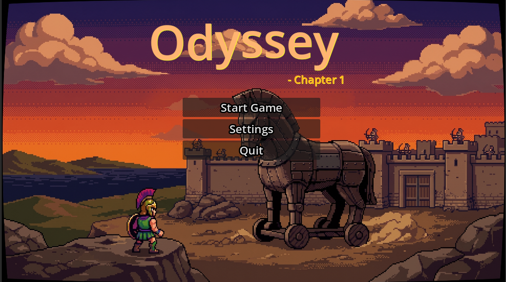

# Odyssey

A Greek mythology-themed 2D minigame collection built in Godot.

Try here: [https://bluecore7.itch.io/the-game-of-odyssey](https://bluecore7.itch.io/the-game-of-odyssey)



## The Game


The story starts from Troy. You are on the way back home (to Ithaca) after the Battle of Troy. In this long sea voyage, you and your crew are gonna face multiple life-taking challenges. Face it with your Hope and reach your Kingdom — Ithaca.

You may end in Helios (Game Over), or you may reach your kingdom.

## Minigames

**Stage 1 — Blue Lotus**: Collect the lotuses before the timer ends (They make you forget home).

**Stage 2 — The Sirens**: Stop the sirens from singing the song that gives you pain and takes your life — spot them.

**Stage 3 — The Cyclopes**: You accidentally landed on the island where the son of Poseidon lives. Escape from the one-eyed giant — a single blow can take your life. 

Use left (←) and right (→) arrows to move!

Use the space button to jump!

## How to Run Locally

### Prerequisites

- [Godot Engine 4.3+](https://godotengine.org/download) (Standard 64-bit — no .NET required)

### Steps

1. **Clone the repository**:
   ```bash
   git clone https://github.com/bluecore7/GameOfOdyssey.git
   ```

2. **Open in Godot**:
   - Launch the Godot Project Manager
   - Click **Import**, browse to the cloned folder, select `project.godot`, and click **Import & Edit**

3. **Run the game**:
   - Press `F5` inside the Godot editor, or from command line:
     ```bash
     godot --path .
     ```

## Credits

- **Engine**: [Godot Engine](https://godotengine.org/)
- **Background Music**: `cynicbattleloop.ogg`
- **Sound Effects**: Typewriter clicks (`typewriter.wav`) and UI blips (`blip.wav`)
- **Art Assets**: AI generated pixel art for Odysseus, Athena, the Sirens, and Polyphemus
